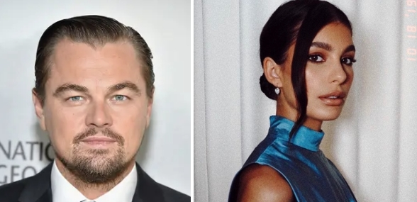
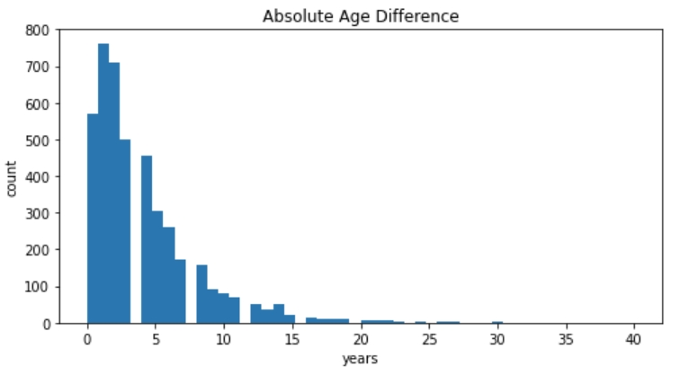

<!-- PAGE 1 -->
              <r> 
# An Analysis of Age Difference in Married Couples
                              

<!-- PAGE 2 -->
# Hypothesis: Percentage age difference falls between 25% older and 20% younger
                              

<!-- PAGE 3 -->
<pre>
Absolute vs. Percentage Difference

Age Delta vs. Marriage Length
</pre>
                       
<!-- PAGE 4 -->
# Maximum Difference?
Dennis Quaid (65) and Laura Savoie (26) — 39 years

# Absolute Age Difference vs. Percentage

<pre>
39 year age difference            (age diff  / age)
    Dennis Quaid's (65) mate is  60% younger (39/65)
    Laura Savoie's (26) mate is 150% older (39/26)
</pre>
<!--  -->
<!-- Leonardo DiCaprio (44) and Camila Morrone (22) — 23 years -->
<!--  -->

<!-- PAGE 5 -->
               
# Example: The man is not always older.
### Sam Taylor-Johnson (52) & Aaron Taylor-Johnson (29) -- 23 years

    

<!-- PAGE  -->
               
# Age difference in years and count

                              
# Absolute Age Difference 
                              

# Absolute Age Difference 15 + years
              

# Marriage Length and count
                  

# Age Comparison Man v. Woman 
## man is older 63.5% of the time
                  

# Marriage Length vs Age Delta

Does age difference correlate to length of marriage
                  

# Credits
images from https://www.buzzfeed.com/sydrobinson1/celeb-couples-age-gaps
data is from https://www.kaggle.com/aagghh/divorcemarriage-dataset-with-birth-dates
